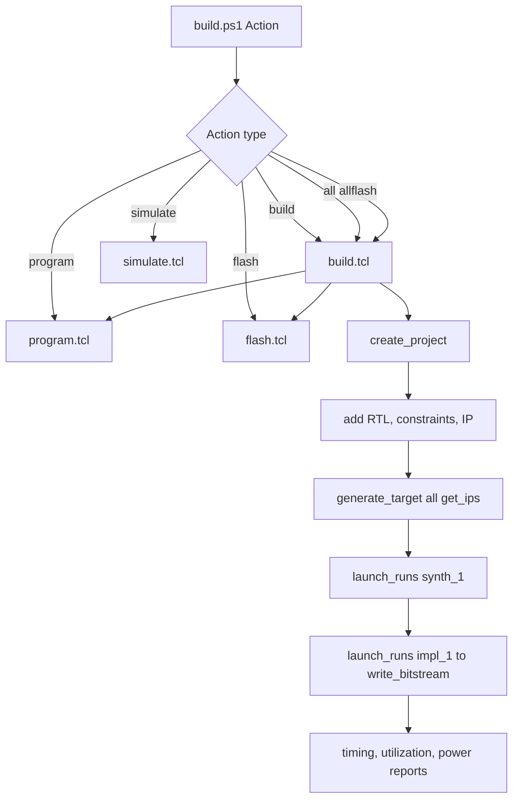

# System Design

## 1. Document Purpose

This report describes the full FPGA system design for the CMOD A7 acoustic anomaly monitor, including:

- End-to-end hardware architecture
- Board-level integration (FPGA, microphone, ESP32, PC/cloud)
- Vivado automation scripts and workflow
- Synthesis and implementation flow (how RTL maps to FPGA fabric)
- High-level description of the Vivado FFT IP configuration and usage

The intent is to provide both implementation traceability and a practical engineering workflow reference.

---

## 2. System Overview

The system performs real-time acoustic monitoring for 3D-printer fault detection using an FPGA DSP + CNN pipeline, then distributes telemetry to:

- Local display path: ESP32 + TFT UI
- Local debug path: USB UART + Python viewer
- Cloud path: ESP32 Wi-Fi uploader -> Supabase -> Next.js dashboard

### 2.1 End-to-End System Diagram

```mermaid
flowchart LR
    MIC[INMP441 I2S Microphone] --> I2S[i2s_receiver.v]
    I2S --> FFTIN[Full-rate FFT path 46.875 kHz]
    I2S --> RMSIN[Decimated RMS path ~7.8 kHz]

    FFTIN --> WIN[fft_window_buffer.v<br/>Hann 512, hop 64]
    WIN --> FFTIP[Xilinx xfft_1 IP<br/>512-pt streaming FFT]
    FFTIP --> MAG[fft_magnitude.v<br/>Alphamax+Betamax]
    MAG --> QTZ[fft_feature_quantizer.v<br/>16-bit to 8-bit log-like]
    QTZ --> PP[spectrogram_pingpong.v<br/>64x64 feature frames]

    PP --> FEED[cnn_axi_feeder.v]
    FEED --> CNN[myproject CNN IP<br/>hls4ml, 100 MHz]
    CNN --> SCORE[cnn_anomaly_scorer.v<br/>MAE score]
    SCORE --> WRAP[cnn_wrapper.v]

    RMSIN --> TOP[recorder_top.v<br/>UART packet FSM]
    WRAP --> TOP
    MAG --> TOP

    TOP --> UART1[UART TX N3 -> ESP32 RX]
    TOP --> UART2[UART TX J18 -> USB-UART]

    UART2 --> PC[Python spectrogram_viewer.py]
    UART1 --> ESP32[ESP32 LVGL firmware]
    ESP32 --> WIFI[Core0 Wi-Fi uploader task]
    WIFI --> DB[Supabase telemetry table]
    DB --> WEB[Next.js web dashboard]
```

### 2.2 Logical Data Products

- RMS telemetry frame (8 bytes)
  - Result, RMS, flags, sequence, MAE metric, checksum
- Spectrogram burst
  - 64 bins, each 16-bit magnitude, sent as 64 x 6-byte packets
- CNN metric
  - 8-bit MAE score (threshold currently MAE >= 26)

---

## 3. Hardware Integration

## 3.1 FPGA Target and Clocking

- Board: Digilent CMOD A7-35T
- Device: xc7a35tcpg236-1
- Base clock input: 12 MHz on pin L17
- Derived clock: 100 MHz CNN domain via MMCM (clk_gen.v)
- CDC architecture:
  - 12 MHz acquisition/FFT/UART domain
  - 100 MHz CNN inference domain
  - Explicit CDC synchronizers and toggle-based pulse transfer

### 3.1.1 Clock and Sample-Rate Budget

| Block / Stage | Clock Domain | Input Rate | Output / Event Rate | Notes |
|---|---|---:|---:|---|
| `i2s_receiver.v` | 12 MHz | INMP441 serial stream | `sample_valid` at **46,875 samples/s** | Generates `i2s_sck = 3 MHz` from 12 MHz (`12/4`) |
| RMS decimator in `recorder_top.v` (`DECIM=6`) | 12 MHz | 46,875 samples/s | **7,812.5 samples/s** (`sample_ena`) | Used for RMS metering and UART windowing |
| FFT input path (`raw_s16`) | 12 MHz | 46,875 samples/s | 46,875 samples/s | Full-band path (no decimation) |
| `fft_window_buffer.v` (`N=512`, `hop=64`) | 12 MHz | 46,875 samples/s | FFT-frame hop rate **732.42 hops/s** | Hop period = `64/46875 = 1.365 ms` |
| `xfft_1` (`fft_frontend.v`) | 12 MHz (aclk wired to `clk`) | Streaming 24-bit samples | Complex bins per frame | 512-point fixed-point FFT, natural-order output |
| `fft_magnitude.v` + downsample | 12 MHz | 512 bins/frame | 64 bins/frame (`mag_valid`) | Keeps bins `<256`, every 4th bin |
| `spec_frame_valid` (in `fft_frontend.v`) | 12 MHz | 64 downsampled bins/frame | **732.42 lines/s** | One 64-bin line per FFT hop |
| `spectrogram_pingpong.v` line write | 12 MHz write clock | 1 line/event | 64-byte line in 64 cycles | `64/12e6 = 5.33 us` line write time |
| `spectrogram_pingpong.v` full frame complete | 12 MHz write clock | 64 lines/frame | **11.44 frames/s** | `732.42/64`; `frame_ready` only pulses when CNN idle |
| `cnn_wrapper` + CNN IP + scorer | 100 MHz | 64x64 frame (4096 px) | Score-ready pulse (`cnn_done`) | Crosses from 12 MHz domain via synchronized toggle |
| CNN inference latency | 100 MHz | 1 frame | ~**1.786 ms/frame** | ~178,600 cycles (model-specific measured value) |
| UART RMS window cadence (`WINDOW_SAMPLES=391`) | 12 MHz | 7,812.5 samples/s | ~**50.05 ms/frame** | `391/7812.5`; drives telemetry packet cadence |

## 3.2 External Interfaces

From constraints/recorder.xdc:

- I2S microphone (INMP441 on PMOD JA)
  - i2s_sck -> P3
  - i2s_ws  -> N1
  - i2s_sd  -> M2
- Buttons
  - btn0 -> A18
  - btn1 -> B18
- LEDs
  - led -> A17
  - led_amp -> C16
- UART
  - uart_tx -> N3 (to ESP32 RX)
  - uart_tx_usb -> J18 (to onboard FTDI / PC)

## 3.3 Integration Notes

- INMP441 is operated as left-channel source.
- FFT path consumes full-rate 46.875 kHz samples for bandwidth retention.
- RMS path uses decimation for stable amplitude metering and packet cadence.
- Dual UART outputs mirror the same stream for simultaneous embedded UI and desktop debug.

---

## 4. Internal FPGA Pipeline

## 4.1 Signal Processing Path

1. Audio capture
- i2s_receiver.v converts serial I2S stream to sample words.

2. Windowing and frame generation
- fft_window_buffer.v applies Hann coefficients from hann_512_q15.mem.
- Frame size 512, hop 64.

3. FFT computation
- xfft_1 IP computes complex FFT bins through AXI-Stream.

4. Magnitude and downsampling
- fft_magnitude.v computes approximate magnitude from real/imag.
- Uses Alphamax+Betamax approximation.
- Keeps first 256 bins and selects every 4th bin -> 64 bins.

5. Feature quantization
- fft_feature_quantizer.v converts 16-bit magnitude to compact 8-bit feature.

6. Spectrogram buffering
- spectrogram_pingpong.v stores 64x64 feature maps.
- Supports overlap between producer (FFT path) and consumer (CNN path).

## 4.2 CNN Path

- cnn_wrapper.v orchestrates feeder, CNN IP, and scorer FSM.
- cnn_axi_feeder.v streams 4096 pixels into CNN AXI input.
- cnn_anomaly_scorer.v computes MAE between input and reconstruction.
- Metric and anomaly bit are synchronized back to 12 MHz packetizer domain.

### 4.2.1 CNN Clocking and Throughput

- CNN subsystem clock: **100 MHz** (`clk_100m` from MMCM)
- Input frame size: **64 x 64 = 4096 pixels**
- Inference latency (model integration measurement): **~1.786 ms/frame**
- Output metric: 8-bit MAE score (`0..255`), thresholded in `recorder_top.v`

Throughput interpretation:

- CNN compute capacity is significantly faster than full-frame generation.
- Effective end-to-end CNN update rate is bounded mainly by spectrogram frame assembly in ping-pong buffering and frame handoff logic.

## 4.3 Packetization

- recorder_top.v frames telemetry and spectrogram packets.
- UART packet state machine:
  - RMS frame states
  - Spectrogram burst states (64 bins)
- Result logic currently classifies anomaly when MAE >= 26.

### 4.3.1 UART Communication Protocol (Tabulated)

UART link settings:

| Parameter | Value |
|---|---|
| Baud rate | 1,000,000 bps (1 Mbaud) |
| Data format | 8N1 |
| Parity | None |
| Stop bits | 1 |
| Flow control | None |

Two frame types are transmitted on both `uart_tx` (N3) and `uart_tx_usb` (J18):

1. Telemetry frame (8 bytes)
2. Spectrogram packet (6 bytes) x 64 per burst

#### A) Telemetry Frame (8 bytes)

Frame pattern: `AA 55 result rms flags seq metric checksum`

| Byte | Field | Width | Description |
|---:|---|---:|---|
| 0 | Sync A | 8 | Fixed `0xAA` |
| 1 | Sync B | 8 | Fixed `0x55` |
| 2 | `result` | 8 | CNN classification (`0` normal, `1` anomaly) |
| 3 | `rms` | 8 | Decimated RMS amplitude (0-255) |
| 4 | `flags` | 8 | Status bits (see table below) |
| 5 | `seq` | 8 | Rolling sequence counter (0-255) |
| 6 | `metric` | 8 | MAE score (or debug byte before CNN first run) |
| 7 | `checksum` | 8 | XOR of bytes 0..6 |

Checksum rule:

| Expression |
|---|
| `checksum = 0xAA ^ 0x55 ^ result ^ rms ^ flags ^ seq ^ metric` |

Flags bit layout (`flags` byte):

| Bit | Name | Meaning |
|---:|---|---|
| 0 | `fpga_active` | `1` when telemetry engine is active |
| 1 | `cnn_anomaly` | `1` when MAE >= threshold |
| 2 | `cnn_ran` | `1` after at least one CNN inference completed |
| 7:3 | Reserved | `0` |

Telemetry cadence:

| Item | Value |
|---|---|
| RMS window samples | 391 @ 7,812.5 samples/s |
| Telemetry interval | ~50.05 ms |
| Telemetry update rate | ~19.98 Hz |

#### B) Spectrogram Packet (6 bytes)

Packet pattern: `DD 77 bin_idx bin_low bin_high checksum`

| Byte | Field | Width | Description |
|---:|---|---:|---|
| 0 | Sync A | 8 | Fixed `0xDD` |
| 1 | Sync B | 8 | Fixed `0x77` |
| 2 | `bin_idx` | 8 | Bin index `0..63` |
| 3 | `bin_low` | 8 | Magnitude low byte |
| 4 | `bin_high` | 8 | Magnitude high byte |
| 5 | `checksum` | 8 | XOR of bytes 0..4 |

Magnitude reconstruction:

| Expression |
|---|
| `magnitude_16b = bin_low | (bin_high << 8)` |

Checksum rule:

| Expression |
|---|
| `checksum = 0xDD ^ 0x77 ^ bin_idx ^ bin_low ^ bin_high` |

Spectrogram burst timing:

| Item | Value |
|---|---|
| Packets per burst | 64 |
| Bytes per packet | 6 |
| Burst payload bytes | 384 |
| Time per packet @ 1 Mbaud (8N1) | ~60 us |
| Full burst time | ~3.84 ms |
| Bin order | 0 to 63 |

Bin-frequency mapping (after FFT downsampling):

| Bin index | Approx center frequency |
|---:|---:|
| 0 | 0 Hz |
| 1 | 366.2 Hz |
| 10 | 3.66 kHz |
| 32 | 11.72 kHz |
| 41 | 15.01 kHz |
| 63 | 23.07 kHz |

Formula:

| Expression |
|---|
| `f(bin) = bin_idx * (46875 / 512) * 4 ≈ bin_idx * 366.2 Hz` |

#### C) Combined Transmission Sequence

| Sequence step | Packet type | Bytes |
|---:|---|---:|
| 1 | 1x telemetry frame | 8 |
| 2 | 64x spectrogram packets | 384 |
| Total per cycle | telemetry + burst | 392 |

Per-cycle timing summary:

| Component | Time |
|---|---:|
| RMS window accumulation | ~50.05 ms |
| Telemetry UART transmit | ~0.08 ms |
| Spectrogram burst UART transmit | ~3.84 ms |
| Total cycle | ~53.97 ms |

Effective full-spectrum cadence is therefore approximately 18 to 20 Hz depending on runtime overlap and scheduler effects.

### 4.3.2 Packet Timing vs DSP/CNN Timing

- RMS telemetry is paced by the decimated RMS window: ~50.05 ms cadence (~20 Hz class).
- Spectrogram UART bursts are emitted after each RMS frame, so displayed/transported spectrum cadence is tied to telemetry windowing.
- CNN operates asynchronously in the 100 MHz domain; latest completed MAE score is inserted into outgoing RMS telemetry frames.

---

## 5. Vivado Scripted Workflow

The project uses script-driven, repeatable builds.

## 5.1 Script Stack

- scripts/build.ps1
  - User entrypoint (PowerShell)
  - Actions: build, program, flash, clean, all, allflash, simulate
  - Calls vivado.bat in batch mode

- scripts/config.tcl
  - Single source of project configuration:
    - PROJECT_NAME, TOP_MODULE, PART_NAME
    - SOURCE_FILES list
    - CONSTRAINT_FILES
    - CNN_IP_DIR
    - BUILD_DIR

- scripts/build.tcl
  - Creates project, adds RTL/constraints/IP
  - Generates IP targets
  - Runs synth_1 and impl_1 to bitstream
  - Emits timing/utilization/power reports

- scripts/program.tcl
  - JTAG volatile programming from generated bitstream

- scripts/flash.tcl
  - Generates MCS image and programs external QSPI configuration memory

- scripts/simulate.tcl
  - Legacy simulation script (currently references old reaction_game example)

## 5.2 Build and Deployment Diagram

## 5.3 Workflow Improvements Already Implemented

1. Single action command interface
- build.ps1 abstracts Vivado CLI complexity into one action switch.

2. Centralized configuration
- config.tcl controls top module, source list, constraints, build output path.

3. Deterministic build output location
- BUILD_DIR supports absolute path (currently C:/fpga_build) to avoid cloud-sync lock issues.

4. Automated report generation
- Build emits timing, utilization, and power reports by default.

5. Separated volatile/non-volatile deployment
- program.tcl and flash.tcl split runtime programming vs persistent boot image flow.

## 5.4 Recommended Next Workflow Refinements

1. Align simulate.tcl with src_main and recorder_top testbenches
- Current simulate.tcl points to legacy src/reaction_game.v paths.

2. Add explicit strategy assignment from config.tcl
- SYNTH_STRATEGY and IMPL_STRATEGY are defined but not yet applied in build.tcl.

3. Add CI check stage for syntax/lint/testbench smoke runs
- Catch issues before long implementation runs.

4. Add artifact manifest
- Auto-export bit, mcs, and key reports to build_reports for release traceability.

---

## 6. Synthesis and FPGA Mapping Flow

Vivado maps the RTL and IP into Artix-7 resources through staged transforms.

## 6.1 Synthesis Engine (synth_1)

Input to synthesis:

- Top-level RTL: recorder_top.v
- Submodules listed in config.tcl SOURCE_FILES
- IP sources:
  - xfft_1.xci (Vivado FFT IP)
  - CNN Verilog set from CNN_IP_DIR
- Constraints: recorder.xdc

Synthesis operations:

- Elaborates HDL hierarchy and resolves generics/parameters
- Infers primitives and maps arithmetic/control into:
  - LUT logic
  - flip-flops
  - BRAM
  - DSP48 where applicable
- Integrates out-of-context generated IP netlists/wrappers

Output:

- Technology-mapped synthesized netlist
- synth_1 run database for implementation handoff

## 6.2 Implementation Engine (impl_1)

Implementation operations:

- opt_design: logic optimization on synthesized netlist
- place_design: place mapped cells into physical sites
- route_design: connect nets across device routing resources
- write_bitstream: generate final programming image

Design closure artifacts generated by build.tcl:

- timing_summary.rpt
- utilization.rpt
- power.rpt
- top-level bitstream under runs/impl_1

## 6.3 Resource Mapping Characteristics for This Design

- BRAM-heavy architecture due to:
  - FFT internal memories
  - spectrogram buffers
  - CNN staging and cache structures
- Multi-clock design (12 MHz + 100 MHz) with explicit asynchronous grouping
- Streaming AXI-style interfaces for FFT and CNN ingress/egress

---

## 7. Vivado FFT IP Block Description

FFT core instance: xfft_1

- Vendor IP: xilinx.com:ip:xfft:9.1
- Transform length: 512
- Architecture: pipelined streaming I/O
- Data format: fixed-point
- Input width: 24 bits
- Output width: 34-bit real + 34-bit imag packed in 80-bit AXI word
- Output ordering: natural order
- Scaling option: unscaled
- Rounding mode: truncation
- Runtime variable length: disabled
- Channel count: 1
- Memory style: BRAM for data, twiddles, reorder paths

## 7.1 AXI Stream Interfaces Used

Input side:

- s_axis_data_tdata [47:0]
- s_axis_data_tvalid
- s_axis_data_tready
- s_axis_data_tlast

Config side:

- s_axis_config_tdata [7:0]
- s_axis_config_tvalid
- s_axis_config_tready

Output side:

- m_axis_data_tdata [79:0]
- m_axis_data_tvalid
- m_axis_data_tlast

In fft_frontend.v:

- A one-shot config value 0x00 is sent to configure forward transform.
- Windowed sample stream is sign-extended to match FFT input packing.
- Output bins are counted explicitly and forwarded to magnitude logic.

Clocking note for this integration:

- `xfft_1` runs from the system `clk` connection in `fft_frontend.v` (12 MHz domain in current top-level wiring).
- The XCI target frequency reflects IP generation intent, while actual runtime frequency is defined by the connected `aclk` in the integrated design.

## 7.2 High-Level FFT Processing Behavior

1. Collect 512-sample window with Hann weighting.
2. Stream into xfft_1 with frame end signaled by TLAST.
3. Receive complex bins in natural order.
4. Compute magnitude approximation.
5. Retain only physically meaningful first half-spectrum and decimate to 64 bins.
6. Deliver packed 64-bin outputs for telemetry and downstream CNN feature generation.

## 7.3 Why This FFT Configuration Fits the Project

- 512-point transform provides useful frequency resolution while preserving throughput.
- Streaming architecture supports continuous operation with overlap framing.
- Fixed-point operation lowers FPGA cost compared to floating point.
- Natural order output simplifies downstream bin indexing and UART packing.

---

## 8. Integration with ESP32, Database, and Dashboard

## 8.1 ESP32 Local Integration

- UART2 on ESP32 receives FPGA telemetry and spectrogram bursts.
- LVGL renders status, RMS dynamics, and spectrogram visualization.

## 8.2 Cloud Upload Path

- wifi_uploader task runs on Core 0.
- Snapshot queue decouples UI/UART loop from HTTP latency.
- HTTPS POST to Supabase REST endpoint uploads selected telemetry fields.

## 8.3 Realtime Dashboard Path

- Next.js web app subscribes to Supabase telemetry inserts.
- Provides live packet counters, anomaly statistics, RMS trend chart, and feed table.

---

## 9. Reproducible Build and Run Commands

From project root:

- Build FPGA:
  - powershell -ExecutionPolicy Bypass -File scripts/build.ps1 -Action build
- Program FPGA (volatile):
  - powershell -ExecutionPolicy Bypass -File scripts/build.ps1 -Action program
- Flash FPGA (non-volatile):
  - powershell -ExecutionPolicy Bypass -File scripts/build.ps1 -Action flash
- Build plus program:
  - powershell -ExecutionPolicy Bypass -File scripts/build.ps1 -Action all
- Build plus flash:
  - powershell -ExecutionPolicy Bypass -File scripts/build.ps1 -Action allflash

---

## 10. Summary

This project implements a complete FPGA-first acoustic monitoring platform with:

- Real-time DSP pipeline (windowing + FFT + feature extraction)
- On-device CNN anomaly scoring
- Deterministic packetized telemetry
- Local embedded UI and desktop analysis tools
- Optional cloud ingestion and realtime dashboard
- Scripted Vivado flow for reproducible synthesis, implementation, and deployment

The architecture is modular and production-leaning, with clear interfaces between acquisition, spectral analysis, ML inference, transport, and observability.
